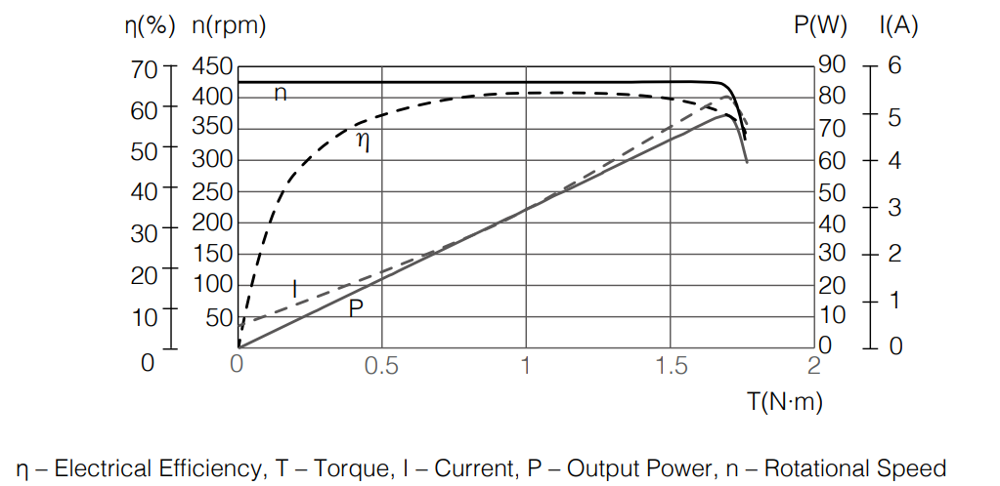
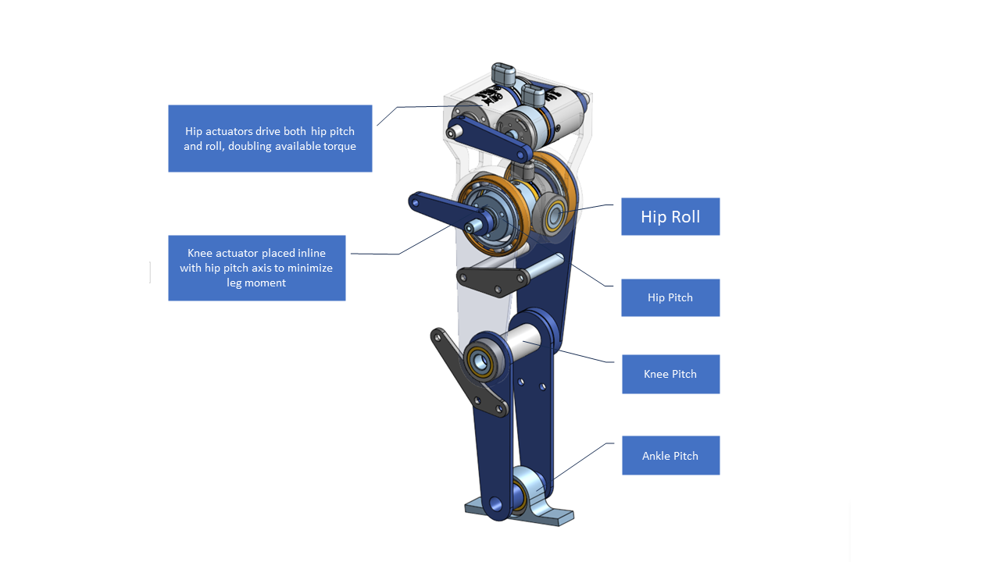

## Members
Stephen Welch, Computer Engineering Student (2024)
stephenwelch@vt.edu

## Mentor
MENTOR NAME HERE

## Current Status
IN PROGRESS

## Project Overview

A torque-controlled bipedal robot for <$1000. The short term goal is assembling and validating a single leg under load.

## Educational Value Added

- Learning how to CAD complex moving assemblies
- Embedded controls
    - Implement torque control for robot joints
    - Serial interface to high-level controller
- High-level controls
    - ROS 2
    - Implementing [step timing adaptation-based walking controller](https://ieeexplore.ieee.org/stamp/stamp.jsp?arnumber=9082021)
    - Implementing [MPC walking control](https://arxiv.org/pdf/2010.08198.pdf)
    - Impedance control
    - Whole body control

## Tasks

<!-- Your Text Here. You may work with your mentor on this later when they are assigned -->

## Design Decisions

### Electronics
- Tethered operation to reduce cost
    - Battery, RPi, Power electronics to be added later
- Teensy commanded over serial by PC running high-level controller
- Robomaster M2006 P36 Brushless Motor
    - Only brushless motor of its size supporting torque control out-of-the-box
    - 1 Nm torque @ 1:36 reduction
    - [Proven performance](https://www.youtube.com/watch?v=_Sh4kRtmAog)
    - Constant torque at all RPMs
      
    - 90g motor, 17g ESC

### Mechanics

- 3 DoF per-leg
    - Pros:
        - Each actuator removed from the design saves $94
        - Reduces mechanical complexity
    - Cons:
        - Since the ankle isn't actuated, the robot is *not* passively stable - it must actively step to maintain balance
            - This makes control more challenging
        - Since hip yaw isn't actuated, the robot yaw can't be controlled directly while walking
- Actuator arrangement
    - Based on Tello Leg: [Video 1](https://www.youtube.com/watch?v=62lo04Up2vc) [Video 2](https://www.youtube.com/watch?v=mn8tCtYHzHI&t=1s) [Paper](https://arxiv.org/abs/2203.00644)
    - Minimizes "reflected inertia" - the moment of inertia of each link the actuator has to move
    - Keeps knee actuator in the leg frame, which reduces torque tracking requirements
    - Combined hip/roll axes
        - Rarely actuated at the same time, effectively doubles available torque to 2 Nm
- Avoid gear/belt transmissions where possible
    - Large losses to friction, etc. esp. at this scale
    - Hard to get right, esp. with 3D prints
- Available torque
    - 1 N*m * 0.2248089431 lbf/N \* 100 cm/m = 22.48 lbf\*cm
    - Actuator linkages designed to be 1:1
    - Assuming 90 deg knee bend:
        - Knee can lift 22.48 lbf\*cm / 8 cm thigh length = 2.81 lbf
        - Thigh can lift 22.48 lbf\*cm * 2 motors / 8 cm thigh length = 5.62 lbf
        - Total weight of components is 107 g per actuator * 0.00220462 lbs/g * 3 actuators = 0.707685 lbs

## Design Misc

The main concern is that torque output won't be adequate for dynamic motions (the static case is addressed briefly above).
Possible fixes for this would include:
- Redesigning for larger, higher-torque actuators
- Designing a custom reduction for the M2006 motor
- Adding an effective reduction in the actuator linkages

## Steps for Documenting Your Design Process

<!-- Your Text Here. You may work with your mentor on this later when they are assigned -->

## BOM + Component Cost
[BOM Link](https://docs.google.com/spreadsheets/d/1Qe1dRF8I_yPayQ6RHrJmCSCA597qFWhmrA_jtBt1tgA/edit?usp=sharing)

## Timeline

<!-- Your Text Here. You may work with your mentor on this later when they are assigned -->

## Useful Links

[CAD](https://cad.onshape.com/documents/4743a97557c0a80d1585b0a7/w/82680a303504770a7b3fa862)
[C610 Motor Controller Library](https://github.com/stanfordroboticsclub/DJIC610Controller)
[BOLT Biped Driver](https://github.com/open-dynamic-robot-initiative/bolt)

## Log

<!-- Your Text Here. You may work with your mentor on this later when they are assigned -->
