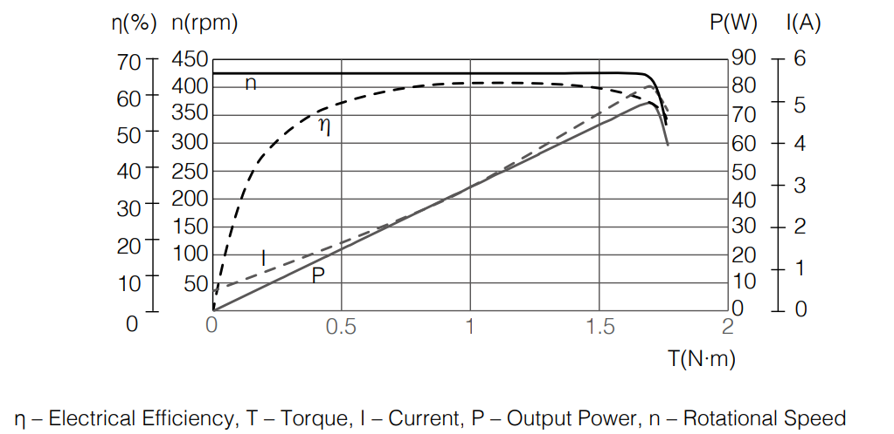
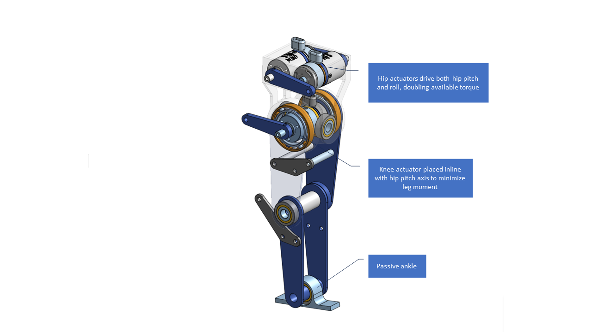

## Members
Stephen Welch, Computer Engineering Student (2024)
stephenwelch@vt.edu

## Mentor
MENTOR NAME HERE

## Current Status
IN PROGRESS

## Project Overview

A torque-controlled bipedal robot for <$1000.

## Educational Value Added

- Learning how to CAD complex assemblies
- Embedded controls
- High-level controls

## Tasks

<!-- Your Text Here. You may work with your mentor on this later when they are assigned -->

## Design Decisions

### Electronics
- Tethered operation to reduce cost
    - Battery, RPi, Power electronics to be added later
- Teensy commanded over serial by PC running high-level controller
- Robomaster M2006 P36 Brushless Motor
    - Only brushless motor of its size supporting torque control out-of-the-box
    - 1 Nm torque @ 1:36 reduction
    - [Proven performance](https://www.youtube.com/watch?v=_Sh4kRtmAog)
    - Constant torque at all RPMs
      

### Mechanics

- 3 DoF per-leg
    - Pros:
        - Each actuator removed from the design saves $94
        - Reduces mechanical complexity
    - Cons:
        - Since the ankle isn't actuated, the robot is *not* passively stable - it must actively step to maintain balance
            - This makes control more challenging
- Actuator arrangement
    - Based on Tello Leg: [Video 1](https://www.youtube.com/watch?v=62lo04Up2vc) [Video 2](https://www.youtube.com/watch?v=mn8tCtYHzHI&t=1s) [Paper](https://arxiv.org/abs/2203.00644)
    - Minimizes "reflected inertia" - the moment of inertia of each link the actuator has to move
- Avoid gear/belt transmissions where possible
    - Large losses to friction, etc. esp. at this scale
    - Hard to get right, esp. with 3D prints

## Design Misc

Current Risks:
Torque output, esp. at hip linkage
Knee linkage

## Steps for Documenting Your Design Process

<!-- Your Text Here. You may work with your mentor on this later when they are assigned -->

## BOM + Component Cost
[BOM Link](https://docs.google.com/spreadsheets/d/1Qe1dRF8I_yPayQ6RHrJmCSCA597qFWhmrA_jtBt1tgA/edit?usp=sharing)

## Timeline

<!-- Your Text Here. You may work with your mentor on this later when they are assigned -->

## Useful Links

[CAD](https://cad.onshape.com/documents/4743a97557c0a80d1585b0a7/w/82680a303504770a7b3fa862)
[C610 Motor Controller Library](https://github.com/stanfordroboticsclub/DJIC610Controller)

## Log

<!-- Your Text Here. You may work with your mentor on this later when they are assigned -->
